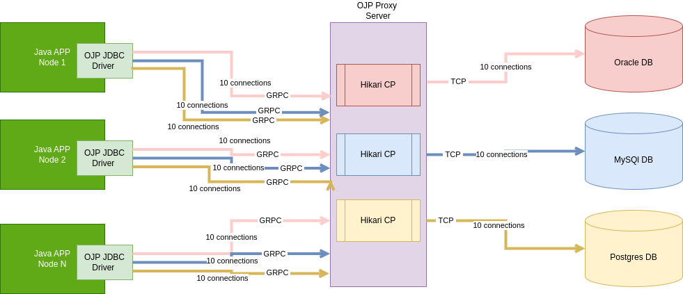

# OJP - Open JDBC Proxy

A JDBC driver and proxy server to decouple applications from relational database connection management.

[](https://buymeacoffee.com/wqoejbve8z)

## Questions we aim to answer:
#### How to autoscale our applications without overloading our relational database(s) with new connections?
#### How to replace native JDBC drivers seamlessly?
#### How to support multiple relational databases at once?

## High Level Design

### [Architectural decision records (ADRs)](documents/ADRs)




* The OJB JDBC driver is used as a replacement for the native JDBC driver(s) previously used with minimum change, the only change required being prefixing the connection URL with ojp_. For example: 
```
ojp_postgresql://user@localhost
```
instead of:
```
postgresql://user@localhost
```
* **Open Source**: OJP is an open-source project that is free to use, modify, and distribute.
* The OJP server is deployed as an independent service sitting and will serve as a smart proxy between the application(s) and their respective relational database(s) controlling the number of connections open against each database.
* **Smart Connection Management***: The proxy ensures that database connections are allocated only when needed, improving scalability and resource utilization. In example below, only when executeQuery is called a real connection is enlisted to execute the operation, reducing the time that connection is hold and allowing for it to be used by other clients meanwhile:
```
        Class.forName("org.openjdbcproxy.jdbc.Driver");
        Connection conn = DriverManager.
                getConnection("jdbc:ojp_h2:~/test", "sa", "");

        java.sql.PreparedStatement psSelect = conn.prepareStatement("select * from test_table where id = ?");
        psSelect.setInt(1, 1);
        ResultSet resultSet = psSelect.executeQuery(); <--- *Real connection allocation*
        
        ...
```
* **Elastic Scalability**: OJP allows client applications to scale elastically without increasing the pressure on the database.
* **GRPC protocol** is used to facilitate the connection of the OJP JDBC Driver and the OJP Proxy Server allowing for efficient data transmission over a multiplex channel.
* OJP Proxy server uses **HikariCP** connection pools to efficiently manage connections.
* OJP supports **multiple relational databases**, in theory it can support any relational database that currently provides a JDBC driver implementation.
 
## Vision
The goal of the OJP project is to provide a free and open-source solution for a relational database-agnostic proxy connection pool. The project is designed to help efficiently manage database connections in microservices, event-driven architectures, or serverless environments while maintaining high scalability and performance.

## Target problem
In modern architectures, such as microservices, event-driven systems, or serverless (Lambda) architectures, a common issue arises in managing the number of open connections to relational databases. When applications need to elastically scale, they often maintain too many database connections. These connections can be held for longer than necessary, locking resources and making scalability difficult. In some cases, this can lead to excessive resource consumption, placing immense pressure on the database. In extreme scenarios, this can even result in database outages.

## The solution
OJP provides a smart proxy to solve this problem by dynamically managing database connections. Rather than keeping connections open continuously, OJP only allocates real database connections when an operation is performed. The proxy ensures that resources are used efficiently by allocating connections only when truly necessary. For example, a real connection to the database is established only when an actual operation (e.g., a query or update) is performed, thus optimizing resource usage and ensuring better scalability.
This intelligent allocation of connections helps prevent overloading databases and ensures that the number of open connections remains efficient, even during heavy elastic scaling of applications.

## Components

### ojp-server
The ojp-server is a gRPC server that manages a Hikari connection pool and abstracts the creation and management of database connections. It supports one or multiple relational databases and provides virtual connections to the ojp-jdbc-driver. The server ensures the number of open real connections is always under control, according to predefined settings, improving database scalability.
#### How to start
>Build the ojp-grpc-commons first.

> Run the class GrpcServer main method.

### ojp-jdbc-driver
The ojp-jdbc-driver is an implementation of the JDBC specification. It connects to the ojp-server via the gRPC protocol, sending SQL statements to be executed against the database and reading the responses. The driver works with virtual connections provided by the ojp-server, allowing the application to interact with the database without directly managing real database connections.
#### How to run
>Build the ojp-grpc-commons first.

>Run any integration tests, the ojp-server is expected to be running in the same machine.

### ojp-grpc-commons
The ojp-grpc-commons module contains the shared gRPC contracts used between the ojp-server and ojp-jdbc-driver. These contracts define the communication protocol and structure for requests and responses exchanged between the server and the driver.
#### How to build
``mvn clean install``


## Feature implementation status
- ✅ Basic CRUD operations.
- ✅ Streamed result set reading.
- ✅ BLOB support.
- ✅ Transactions support.
- ✅ Binary Stream support.
- ✅ ResultSet metadata enquiring.
- ❌ CLOB support.
- ❌ Statement and Prepared statement advanced features.
- 🕓 Connection advanced features.
- ❌ BLOB and CLOB advanced features.
- ❌ Configurable data sources by user and/or database. 
- ❌ RAFT consensus POC.
- ❌ RAFT and connection smart balancing and resizing.


✅ - Done
❌ - Not started
🕓 - In progress